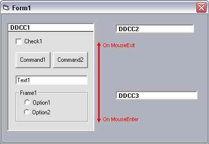



## DropDownControlContainer

### Description

This little container OCX works like dropdown combo exept that it can contain other controls. Dropdown and Collapse can be set to occur either on MouseEnter/Exit or on TitleClick. For those of you interested in how to use Mouse Tracking this is a good example because it uses Subclassing and the Windows MouseLeave and MouseHover system messages to control it's behavior. Try it, download is only 8.5 kB. Tested (and probably works on) Win32 only!
 
### More Info
 

             |
---                |---
**Submitted On**   |2003-02-02 07:36:02
**By**             |[ULLI](https://github.com/Planet-Source-Code/PSCIndex/blob/master/ByAuthor/ulli.md)
**Level**          |Advanced
**User Rating**    |4.6 (179 globes from 39 users)
**Compatibility**  |VB 6\.0
**Category**       |[OLE/ COM/ DCOM/ Active\-X](https://github.com/Planet-Source-Code/PSCIndex/blob/master/ByCategory/ole-com-dcom-active-x__1-29.md)
**World**          |[Visual Basic](https://github.com/Planet-Source-Code/PSCIndex/blob/master/ByWorld/visual-basic.md)
**Archive File**   |[DropDownCo153808222003\.zip](https://github.com/Planet-Source-Code/ulli-dropdowncontrolcontainer__1-42884/archive/master.zip)

